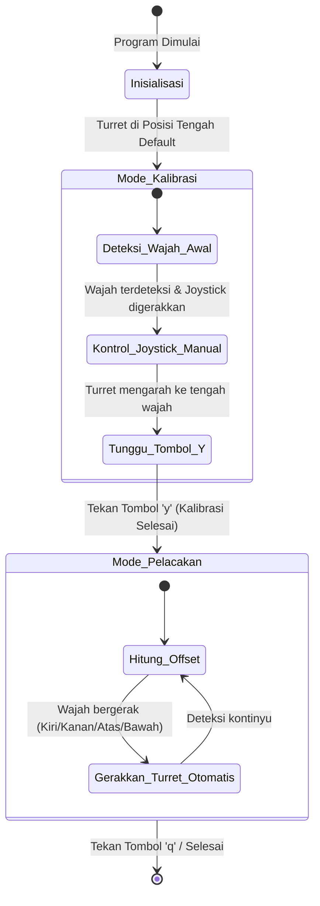

# Logika Sistem Kendali Turret (Face Tracking & Calibration)

Dokumen ini menjelaskan alur logika sistem kendali turret berbasis deteksi wajah (face tracking) yang mengintegrasikan mode kontrol manual via joystick (untuk kalibrasi) dan mode pelacakan otomatis (auto-tracking).

---

## 1. Alur Utama Sistem (State Machine)

Sistem beroperasi dalam dua mode utama secara berurutan:
1. **Mode Kalibrasi (Manual/Joystick)**: Menyelaraskan arah turret ke titik tengah wajah secara manual.
2. **Mode Pelacakan (Otomatis)**: Mengikuti pergerakan wajah secara dinamis berdasarkan selisih koordinat (offset).

---

## 2. Rincian Tahapan Logika

### Tahap 1: Inisialisasi & Kalibrasi Manual (Joystick)
* **Tujuan**: Memastikan turret secara fisik membidik tepat pada posisi tengah wajah target sebelum pelacakan otomatis dimulai.
* **Alur Logika**:
  1. Jalankan kamera dan load model Haar Cascade (`face_detect.py`).
  2. Kamera mendeteksi wajah target dan menentukan koordinat titik tengah wajah saat ini ($X_{wajah}, Y_{wajah}$).
  3. Pengguna menggunakan **joystick** secara manual untuk menggerakkan servo *Pan* (horizontal) dan *Tilt* (vertikal) turret agar kamera/laser turret mengarah tepat ke tengah wajah target.
  4. Selama proses ini, program terus memperbarui posisi sudut servo berdasarkan input joystick.

### Tahap 2: Penguncian Koordinat Referensi (Tombol 'y')
* **Tujuan**: Mengunci posisi "titik nol" atau referensi sebagai dasar perhitungan pergeseran.
* **Alur Logika**:
  1. Ketika turret dirasa sudah tepat mengarah ke tengah wajah, pengguna menekan tombol **'y'** pada keyboard.
  2. Sistem segera merekam dan mengunci koordinat titik tengah wajah saat itu sebagai **Titik Referensi Kalibrasi** ($X_{calib}, Y_{calib}$).
  3. Sistem juga menyimpan sudut servo *Pan* & *Tilt* saat itu sebagai **Sudut Referensi Kalibrasi** ($\theta_{pan\_calib}, \theta_{tilt\_calib}$).
  4. Transisi status (*state transition*) dilakukan dari mode kalibrasi manual ke mode pelacakan otomatis.

### Tahap 3: Pelacakan Wajah Otomatis (Auto-Tracking)
* **Tujuan**: Menjaga agar turret tetap membidik wajah meskipun target bergerak ke kiri, kanan, atas, maupun bawah.
* **Alur Logika**:
  1. Kamera mendeteksi wajah secara real-time dan mendapatkan koordinat baru ($X_{wajah\_sekarang}, Y_{wajah\_sekarang}$).
  2. Hitung jarak pergeseran (offset/error) wajah dari titik referensi kalibrasi:
     $$\Delta X = X_{wajah\_sekarang} - X_{calib}$$
     $$\Delta Y = Y_{wajah\_sekarang} - Y_{calib}$$
  3. Konversi nilai pergeseran piksel ($\Delta X, \Delta Y$) menjadi perubahan sudut servo ($\Delta \theta_{pan}, \Delta \theta_{tilt}$) menggunakan faktor pengali proporsional ($K_p$):
     $$\Delta \theta_{pan} = K_{p\_x} \times \Delta X$$
     $$\Delta \theta_{tilt} = K_{p\_y} \times \Delta Y$$
     *(Catatan: Tanda $+$ atau $-$ disesuaikan dengan arah hadap fisik motor).*
  4. Hitung sudut baru untuk servo:
     $$\theta_{pan} = \theta_{pan\_calib} + \Delta \theta_{pan}$$
     $$\theta_{tilt} = \theta_{tilt\_calib} + \Delta \theta_{tilt}$$
  5. Kirim perintah perubahan sudut tersebut ke turret (mikrokontroler/servo).
  6. Berikan batasan (*clamping*) sudut minimum dan maksimum agar tidak merusak fisik servo (misal: $0^\circ \le \theta \le 180^\circ$).

---

## 3. Skema Parameter & Rumus Kendali

Untuk meminimalisir gerakan menyentak, kita dapat menggunakan pendekatan kendali proporsional sederhana (P Controller) atau PID untuk pergerakan halus:

| Parameter | Keterangan | Nilai Contoh |
| :--- | :--- | :--- |
| $X_{calib}, Y_{calib}$ | Pusat wajah saat tombol 'y' ditekan (titik acuan pelacakan). | *(Dinamis)* |
| $K_{p\_x}, K_{p\_y}$ | Konstanta sensitivitas gerakan horizontal & vertikal. | `0.05` hingga `0.1` |
| $\text{Batas } Pan$ | Rentang sudut aman untuk pergerakan horizontal. | `20°` s.d. `160°` |
| $\text{Batas } Tilt$ | Rentang sudut aman untuk pergerakan vertikal. | `45°` s.d. `135°` |

### Logika Arah Gerak
* Jika $\Delta X > 0$ (wajah bergeser ke kanan layar): Turret berputar ke **kanan** (meningkatkan/menurunkan sudut pan tergantung arah motor).
* Jika $\Delta X < 0$ (wajah bergeser ke kiri layar): Turret berputar ke **kiri**.
* Jika $\Delta Y > 0$ (wajah bergeser ke bawah layar): Turret bergerak ke **bawah** (tilt).
* Jika $\Delta Y < 0$ (wajah bergeser ke atas layar): Turret bergerak ke **atas** (tilt).
